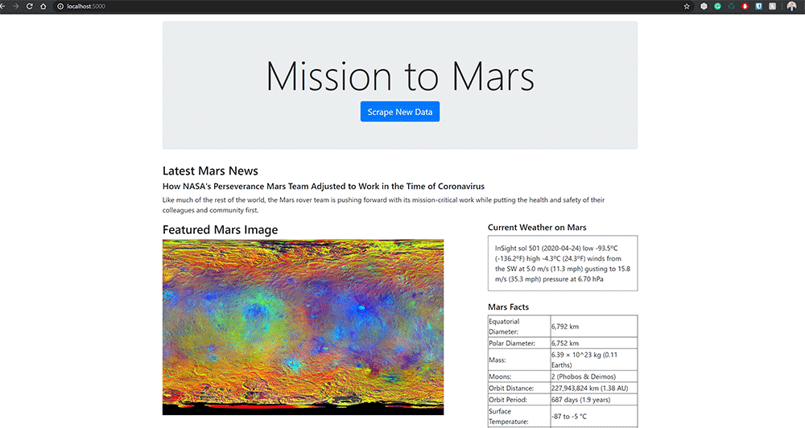

<h1>Web Scraping Challenge</h1>
<h3>Author: Tim Lucas</h3>
<h6>WUSTL Data Analytics Bootcamp homework Week 12</h6>

In this assignment we were tasked with scraping mars related data from 5 differe Mars related websites. The scraped data contained everything from:

<ul>
<li>News</li>
<li>Images</li>
<li>Twitter Feeds</li>
<li>Tables of Data</li>
</ul>

Once the information had been scraped we were tasked with building a Python Flask Applicaiton to run the scrapting file, store the data into a mongo database and display to the user. The final results looked something like this:

<h6>Home Page when no data has been scraped.</h6>

<h6>Home Page once scraping had been completed (top half)</h6>

<h6>Home Page once scraping had been completed (bottom half)</h6>

Skills and tools that were used to complete this assignment include:

<ul>
<li>Jupyter Notebook</li>
<li>Python</li>
<li>Mongo DB</li>
<li>Chromedriver</li>
<li>Packages:<ul>
<li>Beautiful Soup</li>
<li>Splinter</li>
<li>Pandas</li>
<li>Flask</li>
<li>Pymongo</li>
</ul>
</ul>